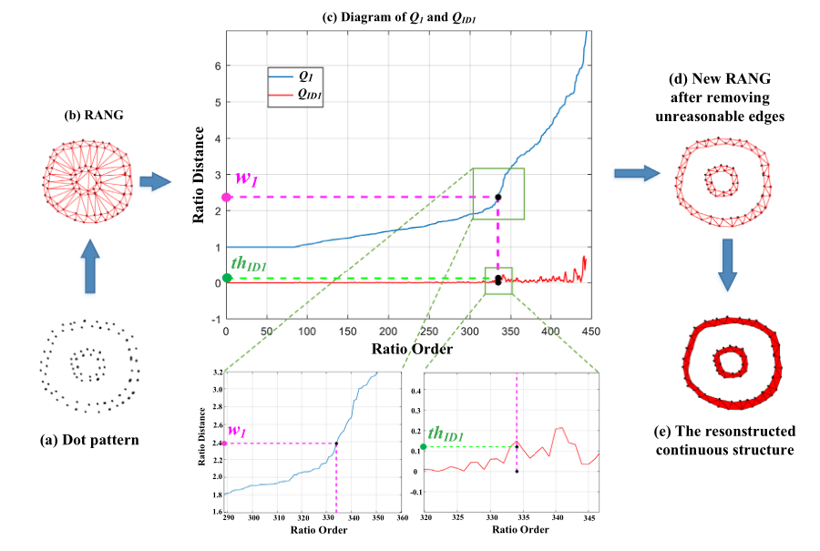

# [A computational model for gestalt proximity principle on dot patterns and beyond](https://jov.arvojournals.org/article.aspx?articleid=2772625)

## 1. Introduction
* reconstruction the continous structure from dot patterns; 
* proposed extended tolerance space theory;
* proposed one-reach and two-reach computational model for Gelstalt principles.
* revealed this model is the extention of Pure Distance Low.
  

## 2. How to use
* run ``DemoSecorder.m``
* then you can find all figures (including one-reach and two-reach results).

## 3. Cite this work
```
@article{peng2021computational,
  title={A computational model for gestalt proximity principle on dot patterns and beyond},
  author={Peng, Peng and Yang, Kai-Fu and Li, Yong-Jie},
  journal={Journal of Vision},
  volume={21},
  number={5},
  pages={23--23},
  year={2021},
  publisher={The Association for Research in Vision and Ophthalmology}
}
```